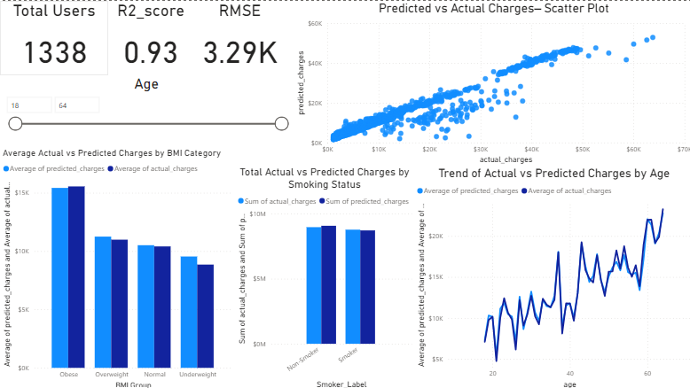

# 🏥 Health Insurance Price Prediction

This project leverages machine learning and data visualization to accurately predict health insurance charges based on customer demographics and habits. It combines a predictive regression model built in Python with an interactive Power BI dashboard for deeper analysis and reporting.

---

## 📌 Project Objective

The goal of this project is to develop a predictive model that estimates the medical insurance cost for individuals based on factors such as age, BMI, smoking status, and more. Understanding these cost drivers can help both insurance providers and policyholders make informed decisions.

---

## ⚙️ Tech Stack

- **Python** (Data Processing & Modeling)
  - `pandas`, `numpy`, `matplotlib`, `seaborn`
  - `scikit-learn` for machine learning
- **Machine Learning Algorithm**
  - `RandomForestRegressor`
- **Visualization Tool**
  - `Power BI` for interactive dashboards
- **Jupyter Notebook** for experimentation and model training

---

## 🤖 Machine Learning Workflow

The following steps were performed in the notebook (`insurance.ipynb`):

1. **Data Cleaning**
   - Handled null values (if any)
   - Converted categorical features (like smoker, sex, region) to numerical using `LabelEncoder`
2. **Exploratory Data Analysis**
   - Visualized age, BMI, and charges distribution
   - Correlation heatmap between features
3. **Feature Engineering**
   - Created dummy variables for multi-class categorical features
   - Normalized feature scales (if needed)
4. **Model Training**
   - Used `RandomForestRegressor` due to its robustness and accuracy for regression tasks
5. **Model Evaluation**
   - **R² Score**: 0.93
   - **RMSE**: \$3,290
   - Created prediction outputs to compare with actual charges
6. **Exported Predictions**
   - Saved the predictions in `insurance_predictions_all.xlsx`

---

## 📊 Dashboard Overview (Power BI)

An interactive dashboard was created using Power BI to showcase:

- 📈 Actual vs. Predicted Charges (scatter plot)
- 📊 Breakdown by BMI Category
- 🚬 Impact of Smoking Status on Costs
- 🧓 Age vs Charges Trend Line
- 👥 Total Users: 1338



> File: `dashboard/insurance_dashboard.pbix`

---

<pre lang="markdown"><code> ## 📁 Project Structure ``` insurance-price-prediction/ ├── data/ │ ├── insurance.csv # Raw dataset │ └── insurance_predictions_all.xlsx # Output predictions ├── dashboard/ │ └── insurance_dashboard.pbix # Power BI dashboard ├── visuals/ │ └── Dashboard_screenshot.png # Dashboard image ├── insurance.ipynb # Jupyter Notebook (ML model) ├── README.md # Project documentation └── .gitignore # Ignored files & folders ``` </code></pre>

---

## 📌 Dataset Description

The dataset `insurance.csv` includes the following columns:

| Feature    | Description                        |
|------------|------------------------------------|
| `age`      | Age of the individual              |
| `sex`      | Gender (`male`, `female`)          |
| `bmi`      | Body Mass Index                    |
| `children`| Number of children covered          |
| `smoker`   | Smoking status (`yes`/`no`)        |
| `region`   | Residential region in the U.S.     |
| `charges`  | Target: Medical insurance charges  |

---

